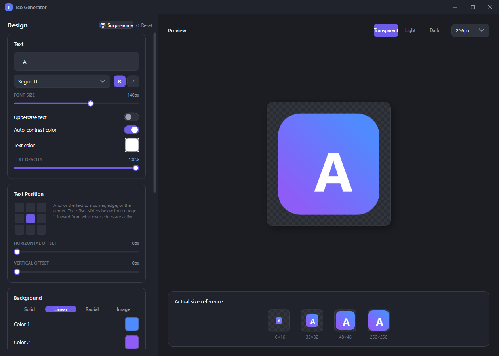

# Ico Generator

A small, professional-looking Windows desktop app (WPF / .NET 8) for designing and exporting multi-resolution `.ico` application icons — background, corner radius, text, border stroke, shadow, and more, with a live preview.



---

## 🇸🇰 Slovensky

**Ico Generator** je desktopová Windows aplikácia (WPF / .NET 8) na navrhovanie a export `.ico` ikon pre aplikácie — priamo z grafického rozhrania, bez potreby externých nástrojov.

### Funkcie

- **Pozadie** — plná farba, lineárny alebo radiálny gradient (s nastaviteľným uhlom), alebo vlastný obrázok (fill / fit / stretch)
- **Tvar** — rádius rohov (0–128 px) s rýchlymi presetmi Square / Rounded / Squircle / Circle
- **Okraj (stroke)** — voliteľný obrys ikony s vlastnou farbou a hrúbkou
- **Text** — obsah, výber fontu (živý náhľad priamo vo fonte), veľkosť, tučné/kurzíva, farba, priehľadnosť, uppercase
- **Pozícia textu** — 9-bodový výber ukotvenia (rohy / hrany / stred) + horizontálny a vertikálny odsah od zvoleného okraja (−128 až +128 px; záporná hodnota posunie text za okraj ikony)
- **Auto-kontrast textu** — automaticky zvolí bielu alebo čiernu farbu textu podľa jasu pozadia
- **Tieň textu** — farba, rozmazanie, hĺbka, smer, priehľadnosť
- **Live náhľad** — vrátane skutočnej veľkosti pri 16×16, 32×32, 48×48 a 256×256 px, s prepínaním pozadia náhľadu (priehľadné / svetlé / tmavé) na overenie čitateľnosti
- **"🎲 Surprise me"** — vygeneruje náhodnú, esteticky ladenú kombináciu farieb, tvaru a fontu
- **Export** — viacrozmerný `.ico` súbor (16/24/32/48/64/128/256 px, plná alfa priehľadnosť), samostatné PNG súbory, alebo kopírovanie do schránky

### Stiahnutie

Hotová aplikácia (nevyžaduje inštaláciu .NET) je dostupná v sekcii **[Releases](https://github.com/karol-zalezak/ico_generator/releases/latest)** — stačí stiahnuť `IcoGenerator.exe` a spustiť.

### Build zo zdrojového kódu

Vyžaduje [.NET 8 SDK](https://dotnet.microsoft.com/download/dotnet/8.0) a Windows.

```bash
git clone https://github.com/karol-zalezak/ico_generator.git
cd ico_generator
dotnet run --project IcoGenerator/IcoGenerator.csproj
```

Samostatný `.exe` (self-contained, bez závislosti na .NET runtime) sa vytvorí príkazom:

```bash
dotnet publish IcoGenerator/IcoGenerator.csproj -c Release -r win-x64 --self-contained true -p:PublishSingleFile=true -p:IncludeNativeLibrariesForSelfExtract=true -o publish
```

---

## 🇬🇧 English

**Ico Generator** is a Windows desktop app (WPF / .NET 8) for designing and exporting `.ico` application icons — directly from a graphical interface, with no external tools required.

### Features

- **Background** — solid color, linear or radial gradient (adjustable angle), or a custom image (fill / fit / stretch)
- **Shape** — corner radius (0–128 px) with quick presets: Square / Rounded / Squircle / Circle
- **Border stroke** — optional outline around the icon with its own color and thickness
- **Text** — content, font picker (live preview in the actual typeface), size, bold/italic, color, opacity, uppercase
- **Text position** — a 9-point anchor picker (corners / edges / center) plus horizontal and vertical offset from whichever edge is active (−128 to +128 px; negative values push the text past the icon edge)
- **Auto-contrast text** — automatically picks black or white based on background brightness
- **Text shadow** — color, blur, depth, direction, opacity
- **Live preview** — including true-size previews at 16×16, 32×32, 48×48, and 256×256 px, with a switchable preview backdrop (transparent / light / dark) to check legibility
- **"🎲 Surprise me"** — generates a random, aesthetically balanced color/shape/font combination
- **Export** — multi-resolution `.ico` (16/24/32/48/64/128/256 px, full alpha transparency), individual PNG files, or copy to clipboard

### Download

A ready-to-run build (no .NET install required) is available on the **[Releases](https://github.com/karol-zalezak/ico_generator/releases/latest)** page — just download `IcoGenerator.exe` and run it.

### Build from source

Requires the [.NET 8 SDK](https://dotnet.microsoft.com/download/dotnet/8.0) and Windows.

```bash
git clone https://github.com/karol-zalezak/ico_generator.git
cd ico_generator
dotnet run --project IcoGenerator/IcoGenerator.csproj
```

To produce a self-contained single-file `.exe` (no .NET runtime dependency):

```bash
dotnet publish IcoGenerator/IcoGenerator.csproj -c Release -r win-x64 --self-contained true -p:PublishSingleFile=true -p:IncludeNativeLibrariesForSelfExtract=true -o publish
```

### Tech stack

WPF, .NET 8, MVVM (no external UI/MVVM packages) — custom-drawn window chrome, styles, and controls.
